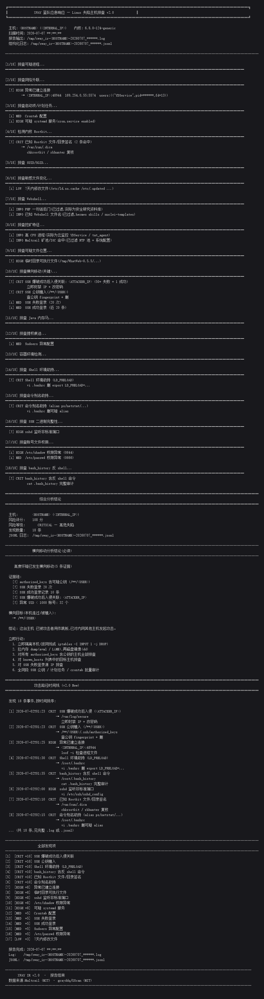

# XWAY IR - Linux 失陷主机一键应急排查

> 🛡️ **蓝队应急响应 / Incident Response / Linux 主机取证**
> v3.1 - 45 个检查模块 + 7 类隧道检测 + 6 类暴力破解 + 攻击路径时间线 + JSON-lines 日志
> 基于 [NOP Team《Linux 应急响应手册 v2.0.2》](https://github.com/NOP-Team) 全量集成 + 9 本应急手册 gap 分析
> 架构借鉴自 [grayddq/GScan](https://github.com/grayddq/GScan) (MIT)


---

## 目录

1. [项目简介](#1-项目简介)
2. [核心特性](#2-核心特性)
3. [适用场景](#3-适用场景)
4. [快速开始](#4-快速开始)
5. [使用方法](#5-使用方法)
6. [排查项详解](#6-排查项详解)
7. [风险评分体系](#7-风险评分体系)
8. [横向移动分析](#8-横向移动分析)
9. [已知限制](#9-已知限制)
10. [配合工具](#10-配合工具)
11. [应急响应 SOP](#11-应急响应-sop)
12. [版本演进](#12-版本演进)
13. [贡献与反馈](#13-贡献与反馈)
14. [免责声明](#14-免责声明)
15. [版权](#15-版权)

---

## 1. 项目简介

**XWAY IR** 是一款面向 **Linux 蓝队 / 应急响应工程师** 的一键排查脚本,用于在疑似失陷的主机上**快速评估入侵痕迹**。

- ✅ **零外部依赖** - 只用 `ps` `ss` `find` `grep` `crontab` `last` 等系统自带命令
- ✅ **纯命令行可视化** - ANSI 颜色 + 分段横幅,SSH 终端直接读
- ✅ **45 个检查模块** - 覆盖挖矿、Webshell、Rootkit、横向移动、Java 内存马、容器逃逸、隧道、暴力破解、SQLi 痕迹、网页暗链等主流场景
- ✅ **风险评分 + 横向移动证据链** - 不只是"列出来",而是"打分"和"判断是不是跳板"
- ✅ **三路输出** - 彩色 stdout(操作员) + `.log`(含 ANSI,人读) + `.jsonl`(SIEM/jq 可消费)
- ✅ **IOC 数据外置** - `lib/` 目录下 22 个文本文件,改文本即可扩展,不动代码
- ✅ **不改主机** - 完全只读,跑完除了可选的日志文件不留下任何痕迹
- ✅ **119 个 bats 测试** - CI 自动化,回归有保障

> 适用版本:Linux 2.6+ / 主流发行版(CentOS / RHEL / Ubuntu / Debian / Kylin / UOS / Alpine)
> 不适用:Windows、AIX、HP-UX(可以参考思路自行移植)

---

## 2. 核心特性

### 2.1 45 个检查模块全景

| 类别 | 模块编号 | 检查点 |
|---|---|---|
| **进程** | 01, 31, 32 | 挖矿/RCE 进程、deleted 文件占用、隐藏进程(proc vs ps) |
| **网络** | 02, 35 | C2 端口外联、Maltrail IOC 命中、SSH/Socks/DNS/HTTP/ICMP 隧道 |
| **持久化** | 03, 19, 21, 22, 23, 26 | crontab/at/systemd、SSH key command= 后门、motd、TCP Wrappers、udev、/etc/skel |
| **Rootkit** | 04, 29 | LKM 模块、ld.so.preload、60+ 文件签名、kallsyms、内核模块签名 |
| **权限** | 05, 12, 17 | SUID/SGID、sudoers、capabilities、shadow/passwd 权限、UID=0 |
| **文件** | 06, 09, 42 | 7 天改动、临时目录可执行、银狐 .so、无主/777/欺骗名/大文件 |
| **Web** | 07, 11, 38, 39, 40 | Webshell、Java 内存马、access log 内存马、Behinder/蚁剑 UA、网页暗链 |
| **挖矿** | 08 | 高 CPU + 矿池配置 + Maltrail 矿池域名 |
| **横向移动** | 10, 43, 44, 45 | SSH 公钥/爆破/known_hosts、SSH 软连接后门、strace 凭据捕获、登录聚合 |
| **后门** | 14, 15, 16, 20, 24, 25 | LD_PRELOAD、alias、sshd wrapper、BASH 函数/trap、Python .pth、PAM |
| **暴力破解** | 36, 37 | SSH/MySQL/FTP/MongoDB/SMTP/Redis |
| **完整性** | 28, 30 | rpm -Va / debsums、GPG 密钥 |
| **配置** | 13, 27, 34 | 容器检测、ptrace_scope/ASLR/iptables、DNS/env |
| **数据库** | 41 | SQLi 痕迹(union/sleep/load_file/xp_cmdshell) |

### 2.2 三路输出

| 输出 | 受众 | 内容 |
|---|---|---|
| 彩色 stdout | 操作员(SSH 终端) | 分段横幅 + 45 模块逐项 + 综合结论 + 横向移动分析 + 攻击路径时间线 |
| `.log` 文件 | 取证留存 | 含 ANSI 颜色,`less -R` 还原,可 `cat -v` 看控制字符 |
| `.jsonl` 文件 | SIEM / jq / 自动化 | 每行一条 JSON,字段:`ts/level/module/title/file/hint/score` |

### 2.3 IOC 数据外置 (lib/)

| 文件 | 内容 | 条目数 |
|---|---|---|
| `lib/iocs/miners.txt` | 挖矿矿池域名 + 进程名 + 配置模式 | ~110 |
| `lib/iocs/c2.txt` | APT/勒索/银行木马 C2 + 可疑 TLD | ~80 |
| `lib/iocs/backdoors.txt` | 已知 Webshell 文件名 | ~50 |
| `lib/iocs/rshell.txt` | 反向 shell 命令模式 | ~30 |
| `lib/iocs/behinder_uas.txt` | **Webshell 工具 UA**(Behinder/蚁剑/Chopper/Godzilla) | ~15 |
| `lib/darklink_keywords.txt` | **网页暗链关键词**(赌博/色情/JS 劫持) | ~30 |
| `lib/sqli_patterns.txt` | **SQLi/NoSQLi 特征模式** | ~25 |
| `lib/rootkit_signatures.txt` | 已知 Rootkit 文件/目录签名 | 60+ |
| `lib/bad_lkm.txt` | 恶意 LKM 模块名 | 80+ |
| `lib/suid_whitelist.txt` | 默认 SUID 白名单 | 40+ |
| `lib/suspicious_ports.txt` | 可疑端口 | 40+ |
| 其他(`cron_keywords` / `scan_tools` / `lateral_procs` / `suspicious_tlds` / `suspicious_services` / `web_users` / `default_capabilities`) | 各类专项 IOC | - |
| `lib/bpftrace_monitor.bt` | bpftrace 隧道监控脚本(可选) | - |

### 2.4 真实运行效果预览

> 以下是脚本在 **1 台被植入 SSH 公钥的云主机**上跑出来的**真实报告**(已打码)。

<p align="center">
  
</p>

> 📌 **打码说明**:截图里所有 IP、主机名、用户名、SSH 公钥、攻击者 IP、来源 IP、SSH 指纹都已替换为占位符,真实信息仅保留在本地运行时的控制台上,不会泄露。
> 这台主机的真实结论是: 🔴 **风险评分 76 分 / CRITICAL 高危失陷 / 横向移动证据 4 条** - 已作为跳板机被攻击者使用。

---

## 3. 适用场景

| 场景 | 是否适用 | 备注 |
|---|---|---|
| 主机被挖矿,溯源感染路径 | ✅ | 模块 1/2/6/8/9 |
| Web 服务器疑似被入侵 | ✅ | 模块 1/7/11/38/39/40 |
| 内网横向移动,找跳板机 | ✅✅ | **模块 10 是核心**,43/44/45 补强 |
| 服务器响应缓慢,排查原因 | ✅ | 模块 1/2/8 |
| 主机被植入 Rootkit | ✅ | 模块 4/29 |
| 数据库被 SQL 注入 | ✅ | 模块 41 |
| 网页被挂暗链 | ✅ | 模块 40 |
| SSH 被植入后门 | ✅ | 模块 16/19/43 |
| 容器/云原生环境应急 | ✅ | 模块 13 + 其他模块在容器中也能跑 |
| Windows 主机排查 | ❌ | 请用 [PowerForensics](https://github.com/Invoke-IR/PowerForensics) / [Sysmon](https://docs.microsoft.com/sysinternals/downloads/sysmon) |
| 取证级深度分析 | ⚠️ | 本工具是"快速排查",深度分析请配合 chkrootkit/rkhunter/avml |

---

## 4. 快速开始

### 4.1 远程一行执行(最简)

```bash
curl -fsSL https://raw.githubusercontent.com/A4n9g7e2l/Xway/main/xway_ir.sh | sudo bash
```

> **强烈建议先保存再执行**,这样可以先看一眼再跑:
> ```bash
> curl -fsSL https://raw.githubusercontent.com/A4n9g7e2l/Xway/main/xway_ir.sh -o xway_ir.sh
> less xway_ir.sh          # 浏览一下
> chmod +x xway_ir.sh
> sudo ./xway_ir.sh        # 确认无误后运行
> ```

### 4.2 克隆仓库(推荐,带 lib/ IOC 库)

```bash
git clone https://github.com/A4n9g7e2l/Xway.git
cd Xway
chmod +x xway_ir.sh
sudo ./xway_ir.sh
```

> ⚠️ **注意**:远程一行执行(4.1)只下载主脚本,**不带 `lib/` IOC 库**。模块 4/5/7/18/19/39/40/41 会因找不到 IOC 文件而跳过。**完整功能请用 4.2 克隆仓库**。

### 4.3 拷贝到目标机

```bash
# 从本机(攻击者主机或跳板)把整个目录传过去
scp -r Xway root@<target>:/tmp/
ssh root@<target> "cd /tmp/Xway && bash xway_ir.sh"
```

---

## 5. 使用方法

### 5.1 基础运行

```bash
sudo bash xway_ir.sh
```

> 推荐 `sudo`,因为模块 1(进程)和模块 10(SSH 公钥、`/etc/hosts`)需要 root 权限才能看全。

### 5.2 6 个 CLI flags

```bash
sudo bash xway_ir.sh --module 1,3,10            # 只跑指定模块
sudo bash xway_ir.sh --severity crit,high        # 只看高危(含 CRIT,hierarchy 自动包含)
sudo bash xway_ir.sh --timeout 30                # 每检查限时 30s
sudo bash xway_ir.sh --no-color                  # 关闭 ANSI 颜色
sudo bash xway_ir.sh --out-dir /tmp/ir           # 指定输出目录
sudo bash xway_ir.sh --json-only                 # 只输出 JSONL(管道场景)
```

**`--severity` hierarchy 语义**(v3.1 新):
- `--severity crit` 只显示 CRIT
- `--severity high` 显示 CRIT + HIGH(自动包含更高级别)
- `--severity high,med` 显示 CRIT + HIGH + MED
- 非法值(如 `--severity superhigh`)会 `exit 2` 报错

### 5.3 保留日志(推荐)

```bash
sudo bash xway_ir.sh 2>&1 | tee -a ir_report_$(hostname)_$(date +%Y%m%d_%H%M%S).log
```

> 脚本默认会在 `/tmp/`(或 `--out-dir`)生成 `.log` + `.jsonl` 两个文件,`tee` 是额外保险。

### 5.4 在 Docker 容器中运行

```bash
docker cp Xway <container>:/tmp/
docker exec -it <container> bash -c "cd /tmp/Xway && bash xway_ir.sh"
```

> 容器里没有 systemd,模块 3/33 会自动空过;模块 13 会提示"在容器内"。

### 5.5 离线环境(无外网)

```bash
# 在有网的机器上克隆
git clone https://github.com/A4n9g7e2l/Xway.git
# 整个目录拷到离线机器
sudo bash xway_ir.sh
```

> 脚本本身不联网,**完全离线**可跑。

### 5.6 最小权限运行(无 sudo)

```bash
bash xway_ir.sh
```

> 没有 root 时,模块 5(全盘 SUID 扫描)和模块 10(其他用户 home)会有大量权限拒绝错误,但**不影响主体功能**。

---

## 6. 排查项详解

### 6.1 模块 1-13(v1.0/v2.0 核心,逐项详解)

#### 模块 1 - 进程排查
- **检测项**:已知矿池进程名(`xmrig` `minerd` `cpuminer` `kinsing` `monero` `stratum` 等)、Web 服务进程派生 bash/sh/python(**RCE 特征**)、`eval()` `exec()` `base64 -d` `wget http` `chmod +x`
- **误报控制**:关键字 `grep -v grep` 排除自身;Web 进程派生 Shell 高优
- **风险等级**:挖矿 = 🔴 Critical,Web RCE = 🟠 Critical

#### 模块 2 - 网络外联
- **检测项**:已知 C2/矿池端口(`4444` `5555` `6666` `1337` `8888` `31337` `1080/1081` `8443`)、排除常见业务端口的 ESTAB 连接、Maltrail C2 IOC 命中
- **工具依赖**:`ss -antp`(`netstat` 已不推荐)
- **误报控制**:只看 `ESTAB` 状态,排除 `:22 :80 :443 :53`

#### 模块 3 - 启动项/计划任务
- **检测项**:用户 crontab、`/etc/crontab` 含 `wget` `curl` `base64` `/tmp/`、`/etc/cron.d/`、at/batch、systemd enabled 服务、cron journal

#### 模块 4 - 内核 Rootkit
- **检测项**:`lsmod` 中的 LKM Rootkit(`diamorphine` `reptile` `suterusu` `adore`)、`/etc/ld.so.preload`(**100% 失陷特征**)、60+ Rootkit 文件/目录签名、`/proc/kallsyms` 残留符号、80+ 恶意 LKM 模块名、dmesg taint
- **局限**:高级 Rootkit 会隐藏自己的模块,`lsmod` 看不到;**配合 chkrootkit / rkhunter / unhide** 才靠谱

#### 模块 5 - SUID/SGID
- **检测项**:`find / -perm /4000 -mtime -30` - 30 天内新增的 SUID、非白名单 SUID(对照 `lib/suid_whitelist.txt`)
- **常见正常 SUID**:`/usr/bin/passwd` `/usr/bin/sudo` `/usr/bin/mount` 等

#### 模块 6 - 敏感文件变化
- **检测项**:`/etc` `/usr/local` `/opt` `/root` `/tmp` 下 7 天内修改的文件
- **误报控制**:排除 `.log` `.sock`

#### 模块 7 - Webshell
- **检测项**:数字命名 PHP/JSP、一句话木马特征(`eval($_POST` `assert($_POST` `system($_POST`)、已知 Webshell 文件名(对照 `lib/iocs/backdoors.txt`)
- **局限**:编码型 / 加密型 / 无特征马查不到,配合河马 / D盾 / 阿里伏羲

#### 模块 8 - 挖矿特征
- **检测项**:CPU > 30% 的进程、全盘搜含 `stratum` `xmrig` `pool.` `wallet` 的配置文件

#### 模块 9 - 可疑文件位置
- **检测项**:`/tmp` `/dev/shm` `/var/tmp` 下的可执行文件、数字命名 `.so`/`.dll`(**银狐家族特征**)、可疑隐藏目录

#### 模块 10 - 横向移动 ⭐核心模块
详见 [第 8 节](#8-横向移动分析)。

#### 模块 11 - Java 内存马
- **检测项**:文件名含 `memshell` `agent` `evil` `hack` 的 JAR、Tomcat `webapps` 下 30 天内的 JSP
- **局限**:**纯内存马**(无文件)查不到,需要 `jcmd` `arthas` 抓运行时类

#### 模块 12 - 提权痕迹
- **检测项**:`/etc/sudoers` 中非 root 全授权、`/etc/sudoers.d/` 新增文件、sudoers 权限异常、文件 capabilities

#### 模块 13 - 容器环境
- **检测项**:`/.dockerenv` / `cgroup` 中 `docker` 字符串
- **仅做标记**,不影响其他模块运行

### 6.2 模块 14-37(v3.0:NOP Team 手册 v2.0.2 全量集成)

| # | 模块 | # | 模块 |
|---|---|---|---|
| 14 | Shell 环境劫持(LD_PRELOAD 等 5 种) | 15 | 命令别名劫持(`alias ps=`) |
| 16 | SSH 后门(sshd 非 ELF / alt port) | 17 | 账号合规(shadow 权限/空密码/UID=0) |
| 18 | bash_history 反 shell + 篡改痕迹 | 19 | SSH key command= 后门 |
| 20 | BASH 后门(函数/trap/builtin 同名) | 21 | motd 后门 |
| 22 | TCP Wrappers spawn/twist 后门 | 23 | udev 规则后门 |
| 24 | Python .pth 后门 + PYTHONPATH | 25 | PAM 后门(pam_exec/pam_permit) |
| 26 | /etc/skel 模板投毒 | 27 | 系统安全配置(ptrace_scope/ASLR/iptables) |
| 28 | 软件完整性(rpm -Va / debsums) | 29 | 内核模块签名(CONFIG_MODULE_SIG) |
| 30 | GPG 密钥(apt-key / rpm-gpg) | 31 | deleted 进程文件(/proc/*/exe) |
| 32 | 隐藏进程(proc vs ps diff) | 33 | 运行服务异常(ExecStart 指向 /tmp) |
| 34 | DNS 配置 + 环境变量 | 35 | 隧道检测(SSH/DNS/ICMP/HTTP/Socks/frp) |
| 36 | SSH 暴力破解(失败 IP/invalid user/爆破成功关联) | 37 | 其他服务暴力破解(MySQL/FTP/MongoDB/SMTP/Redis) |

### 6.3 模块 38-45(v3.1:9 本应急手册 gap 分析新增)

| # | 模块 | 关键检测 | 来源 |
|---|------|---------|------|
| 38 | **Web 内存马** | access log 同 URL 404->200 翻转 / POST 响应 16 字节 AES 块对齐 | 《网络安全事件应急指南》 |
| 39 | **Webshell 工具流量** | Behinder/蚁剑/Chopper/Cknife/Godzilla/天蝎 UA 匹配 | 冰蝎/蚁剑手册 |
| 40 | **网页暗链** | 赌博/色情/JS 劫持/Nginx `sub_filter`/UA 条件劫持 | 《网络安全事件应急指南》 |
| 41 | **数据库 SQLi 痕迹** | MySQL/PostgreSQL 日志 + `~/.mysql_history` 中 `union select`/`sleep(`/`load_file`/`xp_cmdshell` | 奇安信 §2.5.7 |
| 42 | **文件系统异常** | 无主/无组文件 + 777 可执行 + 欺骗性文件名(`...`/`.. `/`. `) + 临时目录 >10M 大文件 | 奇安信 §2.4.3 |
| 43 | **SSH 软连接后门** | `pam_rootok` 劫持:argv[0]=`su`/`chsh`/`chfn` 但 exe 指向 sshd + `find -lname *sshd*` | 《实战笔记》§4.4 |
| 44 | **strace 凭据捕获注入** | `/etc/bashrc`/`profile` 中 `strace -o *.log` 包裹 `ssh`/`su`/`sudo`/`passwd` | 《实战笔记》§4.6 |
| 45 | **登录痕迹聚合** | `lastb` Top IP + `last` 成功 + `useradd`/`userdel`/`usermod` 日志 + `lastlog` 非空账号 | 奇安信 §2.5 |

---

## 7. 风险评分体系

每条发现都有 **分值** + **等级**,累加得到总分。

| 等级 | 颜色 | 典型分值 | 典型项 |
|---|---|---|---|
| 🔴 Critical | 红底白字 | 8–10 | 挖矿进程、LD_PRELOAD、SSH 公钥植入、横向移动 |
| 🟠 High | 黄字 | 7–9 | 异常连接、扫描工具、Web 进程派生 Shell |
| 🟡 Medium | 黄字 | 3–5 | Crontab 配置、SSH 失败登录、Sudoers 异常 |
| 🟢 Low | 绿字 | 1–3 | 7 天内改动的文件 |
| ⚪ Info | 青字 | 0 | 容器标记、最近登录 |

**总分阈值**:

| 总分 | 等级 | 结论 |
|---|---|---|
| ≥ 50 | 🔴 **CRITICAL - 高危失陷** | 立即隔离 + 全量取证 |
| 30–49 | 🟠 **HIGH - 中危失陷** | 24h 内处置 |
| 15–29 | 🟡 **MEDIUM - 可疑** | 72h 内复盘 |
| 5–14 | 🟢 **LOW - 低危** | 例行巡检级别 |
| < 5 | ⚪ **INFO** | 暂未发现失陷 |

> ⚠️ **分数是参考,不是判决**。**横向移动证据链** 的权重高于纯分数。

---

## 8. 横向移动分析

> 这是本脚本**最有价值**的部分。模块 10 采集 **9 类证据**,分 3 档判定。v3.1 的 43/44/45 补强了软连接后门、strace 注入、登录聚合。

### 8.1 9 类证据

| # | 证据 | 检测命令 |
|---|---|---|
| 1 | `authorized_keys` 含可疑公钥 | `cat /root\|/home/*/.ssh/authorized_keys` 过滤已知合法 key |
| 2 | `known_hosts` 列出连过的内网主机 | `cat /root/.ssh/known_hosts` |
| 3 | SSH 失败登录 ≥ 20 次(爆破痕迹) | `grep "Failed password" /var/log/auth.log` |
| 4 | SSH 成功登录(列时间和来源 IP) | `grep "Accepted" /var/log/auth.log` |
| 5 | `/etc/hosts` 含可疑 TLD 劫持 | `cat /etc/hosts \| grep ".tk/.top/.xyz/..."` |
| 6 | 横向扫描工具残留 | `find / -name "nmap/masscan/hydra/medusa"` 排除系统包 |
| 7 | SSH 隧道 / nc 反向进程运行中 | `ps \| grep "ssh -R\|nc -l\|socat"` |
| 8 | 异常账号(UID < 1000 但无家目录) | `awk '$3 < 1000 && $3 != 0' /etc/passwd` |
| 9 | 最近 20 条 SSH 登录(`last -i`) | `last -n 20 -i` |

### 8.2 三档判定

#### 情形 A:无证据(0 条)
```
✅ 未发现横向移动痕迹
结论:这台主机 大概率是初始入侵点 或 孤立失陷端,
    尚未对其他内网主机发起攻击。
```

#### 情形 B:少量证据(1–2 条)
```
⚠️ 横向移动证据有限(N 条)
- 列出所有证据
结论:发现少量可疑痕迹,但不足以判断成熟横向移动。
建议:
  1. 拉取 auth.log / secure 完整记录
  2. 检查 /root/.bash_history 找命令轨迹
  3. 对同网段主机跑 SSH 登录日志比对
```

#### 情形 C:大量证据(≥ 3 条)
```
🔴 高度怀疑已发生横向移动(N 条证据)
证据链:[!] ... × N
横向目标(本机连过/被植入):-> 主机列表
结论:这台主机 已被攻击者用作跳板,已对内网其他主机发起攻击。

立即行动:
  1. 立即隔离本机(拔网线或 iptables -I INPUT 1 -j DROP)
  2. 拉内存 dump(avml / LiME),再磁盘镜像(dd)
  3. 对所有 authorized_keys 含公钥的主机全部排查
  4. 对 known_hosts 列表中的目标主机排查
  5. 对 SSH 失败登录源 IP 排查
  6. 全网段 SSH 公钥 / 计划任务 / crontab 批量审计
```

---

## 9. 已知限制

1. **`set +e` 不中断** - 任一命令失败不影响后续(最大化输出),但可能在某些环境下产生大量 permission denied。
2. **部分命令需要 root** - 模块 5(全盘 SUID)和模块 10(其他用户 home)需要 sudo,普通用户跑会缺数据。
3. **不替代专业工具** - 高级 Rootkit / 内存马 / 加密流量需要 chkrootkit / rkhunter / 河马 / D盾 / 流量分析设备。
4. **关键字检测有漏报** - 攻击者只要稍作变形(用 `ev al` / `ba se64 -d` 加空格)就能绕过。建议配合 yara + 行为检测。
5. **不具备修复能力** - 脚本只"看",不"动"。处置请人工执行。
6. **不修改任何文件** - 跑完除了可选的日志文件,不留下任何痕迹。

### 9.1 v3.1 修复的关键 bug

| Bug | 影响 | 修复 |
|---|---|---|
| `--severity` 子串匹配 | `*crit*` 误匹配 `critical`/`critlow`;`high` 不含 CRIT | 改精确成员比对 + hierarchy(`lvl_num >= f_num`) |
| JSONL 转义不全 | 只转义 `"`,漏 `\`/换行/控制字符;攻击者控 hostname 含 `\033[2J` 污染 SIEM | 加 `strip_ctl()`(tr -d 控制字符)+ `json_escape()`(纯 bash 替换 `\`/`"`/`\n`/`\r`/`\t`) |
| `load_ioc_pattern` regex 注入 | IOC 文件含 `.*`/`(`/`|` 会让 grep 退化成 regex,误报满屏 | awk 转义 `[][\\.()*+?{|^$]` 后用 `paste -sd'|'` 拼 alternation |
| FINDINGS `\|` 分隔错位 | title/file/hint 含 `\|` 时 timeline 列错位(bash_history `echo a \| nc` 必触发) | 改用 `\x1f` Unit Separator + `LC_ALL=C sort` |

### 9.2 v1.0.1 修复的已知误报

| 误报 | 原因 | 修复 |
|---|---|---|
| `/etc/chrony/chrony.conf` 误判为挖矿配置 | grep 的 `pool\.` 关键词在 NTP 池域名 `pool.ntp.org` 上误报 | 改为只搜 `stratum+tcp / xmrig / c3pool` 等**矿池专用**关键词 |
| `/home/<USER>/.hermes/skills/` 误判为 Webshell | 蓝队/红队安全研究人员的资料库,本身就是合法 POC 资料 | 扫描时显式排除 `nuclei-templates` `.hermes/skills` `htb` `thm` `oscp` 等 |
| `/home/<USER>/WhatWeb-0.5.5/` 提示为可疑文件 | WhatWeb 是合法的 Web 指纹识别工具 | **不修复** - 仍提示,但脚本下方说明文字标注"在授权测试机器上为正常" |

---

## 10. 配合工具

| 工具 | 用途 | 链接 |
|---|---|---|
| **chkrootkit** | Rootkit 扫描 | http://www.chkrootkit.org/ |
| **rkhunter** | Rootkit + 后门扫描 | http://rkhunter.sourceforge.net/ |
| **ClamAV** | 恶意文件扫描 | https://www.clamav.net/ |
| **unhide** | 隐藏进程/端口发现 | http://www.unhide-forensics.info/ |
| **avml** | Linux 内存 dump(在线版) | https://github.com/microsoft/avml |
| **LiME** | Linux 内存 dump(内核模块) | https://github.com/504ensicsLabs/LiME |
| **dd / dc3dd** | 磁盘镜像 | (系统自带) |
| **volatility** | 内存取证分析 | https://www.volatilityfoundation.org/ |
| **河马 / D盾** | Webshell 扫描(在线) | (第三方) |
| **arthas** | Java 内存马抓取 | https://arthas.aliyun.com/ |
| **bpftrace** | 隧道流量深度定位 | https://bpftrace.org/ |

---

## 11. 应急响应 SOP

> 推荐的标准流程,与本工具结合使用。

```
┌────────────────────────────────────────────────────────────┐
│ 步骤 1:隔离                                                 │
│   拔网线 / iptables -I INPUT 1 -j DROP / 云上安全组断网        │
│   (注: 断网前先准备好取信用工具)                                │
├────────────────────────────────────────────────────────────┤
│ 步骤 2:取证 (主机仍在线)                                     │
│   · 内存: avml > mem.dump  或  insmod lime.ko               │
│   · 进程: ps auxwwf > proc.txt                               │
│   · 网络: ss -antp > net.txt; iptables-save > fw.txt        │
│   · 文件: tar czf etc.tgz /etc; tar czf var.tgz /var        │
├────────────────────────────────────────────────────────────┤
│ 步骤 3:排查 ← ← ← 本工具在这里                              │
│   sudo bash xway_ir.sh 2>&1 | tee ir.log                    │
├────────────────────────────────────────────────────────────┤
│ 步骤 4:评估 + 决策                                            │
│   · 看总分 + 横向证据 -> 决定是否上溯/扩大范围                    │
│   · 通知相关方(法务、上级、监管?)                              │
├────────────────────────────────────────────────────────────┤
│ 步骤 5:修复                                                  │
│   · kill -9 恶意进程                                          │
│   · 清除 crontab / systemd 持久化                             │
│   · 删除 Webshell / 挖矿 binary                               │
│   · 改所有相关密码 + SSH key                                  │
│   · 必要时重装系统                                             │
├────────────────────────────────────────────────────────────┤
│ 步骤 6:加固 + 复盘                                             │
│   · 关闭密码登录,改公私钥                                     │
│   · 加 fail2ban / 异地登录告警                                │
│   · 写事件复盘报告(PDF/PPT 交给管理层)                         │
└────────────────────────────────────────────────────────────┘
```

---

## 12. 版本演进

| 版本 | 日期 | 模块数 | 代码行数 | 关键变化 |
|---|---|---|---|---|
| v1.0 | 2026-07-02 | 13 | 357 | 初始发布,核心 13 模块 |
| v1.0.1 | 2026-07-02 | 13 | 360 | 修挖矿配置/Webshell 误报 |
| v2.0 | 2026-07-07 | 18 | 651 | 借鉴 GScan:IOC 外置、JSONL、攻击时间线 |
| v3.0 | 2026-07-08 | 37 | 850 | 集成 NOP Team 手册 v2.0.2 全量(+19 模块) |
| **v3.1** | **2026-07-19** | **45** | **1064** | **9 本应急手册 gap 分析(+8 模块)+ 4 个 P0 bug 修复** |

详见 [CHANGELOG.md](CHANGELOG.md)。

### v3.1 资料来源致谢

- 奇安信安服团队《网络安全应急响应技术实战指南》
- 深信服《网络安全事件应急指南》
- 《应急响应实战笔记 2020》
- 《Linux 应急响应流程及实战演练》
- 《应急响应 溯源分析》
- 《冰蝎、蚁剑过流量监控改造及红队经典案例分享》
- [NOP Team《Linux 应急响应手册 v2.0.2》](https://github.com/NOP-Team)
- [grayddq/GScan](https://github.com/grayddq/GScan)(MIT)
- [stamparm/maltrail](https://github.com/stamparm/maltrail)(MIT,IOC 来源)

---

## 13. 贡献与反馈

- **Issue**: https://github.com/A4n9g7e2l/Xway/issues
- **PR**: 欢迎!请保持 shellcheck 通过、函数化、不引入新依赖。
- **新检测规则建议**:在 Issue 里贴出"你想检测的 IOC 关键字 + 误报控制方法"。
- **IOC 库扩展**:直接 PR `lib/` 下的文本文件,加注释说明来源。

---

## 14. 免责声明

⚠️ **本工具仅限用于已获授权的安全测试 / 自有主机应急响应 / 教育研究用途。**

- 未经授权对他人主机运行此工具,可能违反《网络安全法》《刑法》第 285/286 条等法律法规。
- 脚本**不做任何修改动作**,但**会读取大量敏感文件**(`/etc/shadow`、`authorized_keys`、日志等),请妥善保管运行产生的输出。
- 作者**不对使用本工具造成的任何直接或间接后果负责**。

---

## 15. 版权

```
MIT License

Copyright (c) 2026 A4n9g7e2l
```

详见 [LICENSE](LICENSE) 文件。IOC 库来源标注见 [lib/iocs/LICENSE.notice](lib/iocs/LICENSE.notice)。

---

<p align="center">
  🛡️ <b>XWAY 蓝队</b> · 攻防不息,守护不止
</p>
